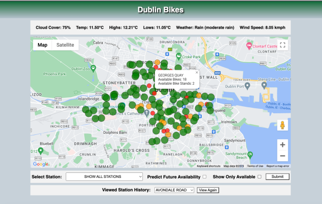
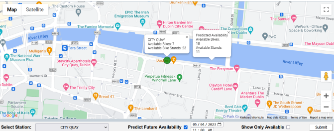

# Dublin Bikes Web Application

## Overview

This project is a web application designed to complement the Dublin Bikes rental service. It provides users with real-time bike availability, weather conditions, and predictive occupancy forecasts based on historical data. The interactive map allows users to locate stations, check bike availability, and filter stations based on their needs. The project was developed as part of a team software engineering assignment.

## Features

**Weather Information**: Retrieves and displays real-time weather data using OpenWeather API.

**Real-time Data**: Fetches and displays live bike availability from JCDecaux's API.

**Google Maps Integration**: Stations are displayed with color-coded markers indicating availability.

🟢 Green (Large): High availability.
🟠 Amber (Medium): Low availability.
🔴 Red (Small): No available bikes.

**Station Selection**: Users can select a station from a dropdown or by clicking a marker on the map.

**Availability Filtering**: Users can filter to view only stations with available bikes.

**Predictive Model**: Users can select a future date and time to view predicted bike availability.

**Station History Tracking**: Recently viewed stations are stored locally and can be revisited from a dropdown.

**Responsive Design**: Works for both desktop and mobile use.

## Screenshots

### Full View

### Zoomed View

## Technologies Used

### Frontend

**HTML, CSS, JavaScript** – for structuring, styling, and interactive UI elements.

**Google Maps API** – for visualizing station locations and bike availability.

### Backend

**Flask** – Python web framework for handling API requests.

**SQLAlchemy** – ORM for database interactions.

**MySQL** – database used for storing bike and weather data.

**AWS RDS** – cloud database for storing real-time data.

**Python Scrapers** – scripts for periodically fetching and storing data from APIs.

## Project Architecture

**Data Collection**: Python scripts scrape data from JCDecaux and OpenWeather APIs every 5 minutes.

**Database Storage**: Data is stored in a MySQL database hosted on AWS RDS.

**Backend Processing**: Flask and SQLAlchemy handle API requests and serve data to the frontend.

**Frontend Display**: JavaScript dynamically updates the UI with real-time and predicted availability data.

## Data Analytics

The app includes a predictive feature to estimate bike availability at a given station based on historical data.

The prediction model returns the mean availability for a selected station based on the weekday and time.

The model calculates the average bike availability for all recorded data points within a 10-minute window for the same weekday in past weeks.

Example: If a user selects Tuesday at 9:00 AM, the app calculates the average bike availability for that station across all Tuesdays from 8:50 AM to 9:10 AM.

## Contributions

While this was a group project, my contributions included:

**Frontend Development**: Designed and implemented the CSS styles and structured the HTML layout.

**JavaScript Development**: Contributed to bikeapp.js, specifically handling UI interactions.

**Backend Development**: Worked on bikeapp.py, including integrating Flask with the SQL database.

**Database Integration**: Connected the Flask application to MySQL using SQLAlchemy.

## Notes

The original database instance is no longer available, as it was scrubbed after the project was graded.

The predictive model was initially planned to use machine learning but was later replaced with a mean-based prediction model due to time constraints.

API keys have been removed for security reasons. Users must provide their own JCDecaux, OpenWeather, and Google Maps API keys in a config.py file.

## Future Enhancements

Rebuild the project with React (frontend) and Java (backend) to utilize new skills.

Improve prediction accuracy with a proper machine learning model.

## License

This project was developed as part of an academic assignment and is not intended for commercial use.